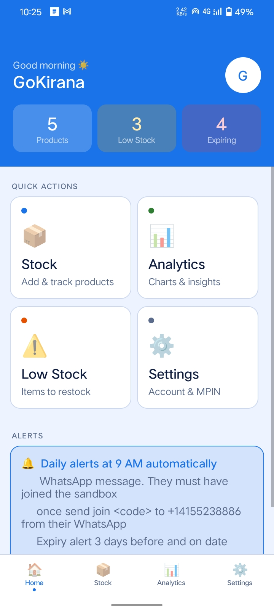
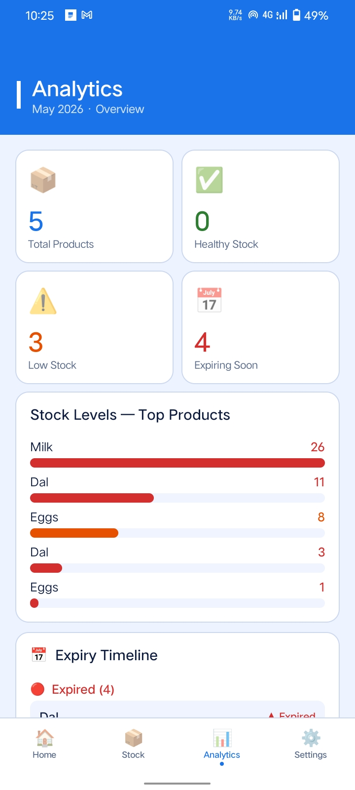
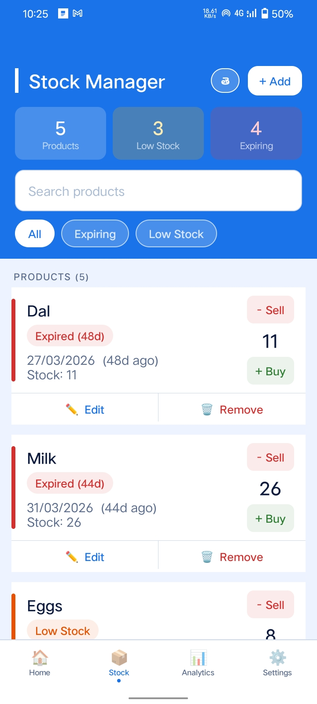
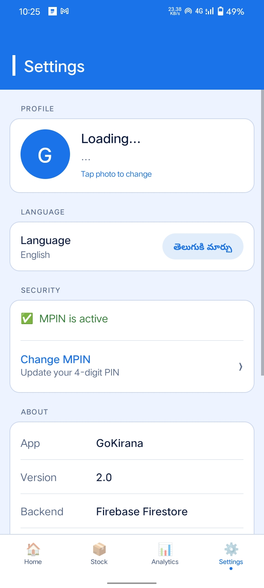

# GoKirana 🛒

A simple Android app to help small kirana store owners manage their stock, track expiry dates, and get alerts before products expire or run out.

Built with Java and Firebase. Works on any Android phone (Android 7.0 and above).

---

## Why I Built This

Small kirana store owners lose money every day because they don't notice when products are about to expire or when popular items are running out. Most of them don't have time to check every product manually. I built GoKirana to solve this — the app tracks everything and sends automatic alerts so the shopkeeper can take action in time.

I also added full Telugu language support because most kirana owners in Andhra Pradesh and Telangana are more comfortable in Telugu than English.

---

## What the App Does

- **Track stock** — add products with quantity, expiry date, and low stock limit
- **Expiry alerts** — get notified 3 days before a product expires
- **Low stock alerts** — get notified when a product hits your set limit
- **Voice alerts in Telugu** — the phone speaks the alert out loud when you open the app
- **WhatsApp alerts** — daily message to your own WhatsApp every morning at 8 AM
- **Analytics** — bar chart showing stock levels, expiry timeline, restock list
- **Bilingual** — switch between Telugu and English with one tap
- **MPIN security** — 4-digit PIN required every time you open the app
- **Profile photo** — add your photo, shows on the home screen

---

## Screenshots


| Home | analytics | stock | settings |
|-------|------|-------|
-----------|
|  | | 
|  |


## Tech Stack

| What | Details |
|------|---------|
| Language | Java |
| IDE | Android Studio |
| Backend | Firebase (Auth + Firestore) |
| Database | Cloud Firestore (real-time) |
| Architecture | MVVM with ViewModel and LiveData |
| Alerts | AlarmManager (scheduled at 8 AM, 1 PM, 7 PM) |
| WhatsApp | Twilio API |
| Voice | Android built-in TextToSpeech (Telugu) |
| Min Android | 7.0 (API 24) |

---

## How Alerts Work

The app sends 3 types of alerts:

**1. In-app banner + voice** — shows once when you open the app. You will see a banner slide down with the alert, and the phone speaks it out loud in Telugu. Tap "Mark as Handled" to dismiss it permanently for that session.

**2. Push notifications** — sent automatically in the background even when the app is closed:
- 8 AM — full summary of all expiring products and low stock items
- 1 PM — only critical items (expiring today or tomorrow)
- 7 PM — evening reminder

**3. WhatsApp message** — sent to your own WhatsApp number once a day at 8 AM through Twilio. Bilingual English and Telugu.

> Alerts for expiry only fire from 3 days before — not earlier. Low stock only fires when quantity reaches your set threshold.

---

## Setup

### 1. Clone the project

```bash
git clone https://github.com/yourusername/GoKirana.git
```

Open in Android Studio.

### 2. Firebase setup

1. Go to [console.firebase.google.com](https://console.firebase.google.com)
2. Create a new project called GoKirana
3. Add an Android app — package name: `com.harsha.kirana`
4. Download `google-services.json` and paste it into the `app/` folder
5. Enable **Email/Password** authentication
6. Create a **Firestore database** and paste these security rules:

```
rules_version = '2';
service cloud.firestore {
  match /databases/{database}/documents {
    match /users/{userId} {
      allow read, write: if request.auth != null && request.auth.uid == userId;
    }
    match /users/{userId}/products/{productId} {
      allow read, write: if request.auth != null && request.auth.uid == userId;
    }
    match /feedback/{feedbackId} {
      allow create: if request.auth != null;
      allow read: if request.auth != null && resource.data.uid == request.auth.uid;
    }
  }
}
```

### 3. Twilio WhatsApp setup

1. Sign up at [twilio.com](https://twilio.com) — free account
2. Go to **Messaging → Try it out → Send a WhatsApp message**
3. Send the join message from your WhatsApp (e.g. `join safety-example` to `+14155238886`)
4. Copy your Account SID and Auth Token from the dashboard
5. Open `WhatsAppHelper.java` and fill in:

```java
static final String ACCOUNT_SID = "ACxxxxxxxxxxxxxxxxxx"; // your SID
static final String AUTH_TOKEN  = "your_token_here";      // your token
```

> Note: With the free Twilio sandbox, each user needs to send the join message once before they can receive alerts. For a real deployment you would upgrade to a paid Twilio account.

### 4. Build and run

```
Build → Clean Project → Rebuild Project → Run
```

---

## Project Structure

```
app/src/main/java/com/harsha/kirana/

├── AppTheme.java            — all colors in one place
├── UiHelper.java            — reusable UI components
├── AnimationHelper.java     — all animations
├── LangHelper.java          — Telugu/English translations (60+ strings)
├── AlertSession.java        — tracks which alerts showed this session
├── SingleLiveEvent.java     — LiveData that fires once (stops repeated alerts)
├── Product.java             — product data model
├── DashboardViewModel.java  — business logic, Firestore operations
├── NotificationHelper.java  — scheduled alarms, push notifications
├── WhatsAppHelper.java      — Twilio WhatsApp messages
├── VoiceAlertHelper.java    — Telugu text-to-speech
├── SplashActivity.java
├── LoginActivity.java
├── SignupActivity.java
├── MpinActivity.java
├── HomeActivity.java
├── DashboardActivity.java   — main stock management screen
├── AnalyticsActivity.java
├── SettingsActivity.java
└── FeedbackActivity.java
```

---

## Firestore Data

```
users/
  {uid}/
    name: "Harsha"
    phone: "9876543210"
    createdAt: 1234567890

    products/
      {productId}/
        name: "Amul Milk 1L"
        quantity: 6
        expiryDate: "20/06/2026"
        lowStockThreshold: 3
```

---

## Features I Want to Add Later

- [ ] Barcode scanner for adding products
- [ ] CSV/PDF export of stock report
- [ ] Dark mode
- [ ] Product categories (Dairy, Grains, Snacks etc.)
- [ ] Multiple store support

---

## Known Limitations

- Twilio sandbox requires each user to send a join message once before they receive WhatsApp alerts. This is a WhatsApp policy, not specific to this app.
- Voice alerts work best on phones with Google Text-to-Speech installed (comes pre-installed on most Android phones with Google Play).
- Telugu voice quality depends on the TTS engine installed on the phone.

---

## License

This project is for educational purposes. Feel free to use it as reference.

---

## Contact

Built by **Harsha**

If you find a bug or have a suggestion, use the feedback option inside the app or open an issue here on GitHub.
